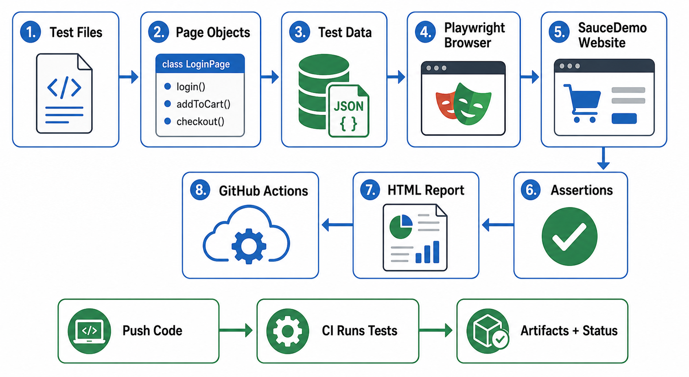

# Playwright E-Commerce Automation

Playwright + TypeScript automation framework for a demo e-commerce workflow on SauceDemo.

This project shows how to automate real user flows, organize browser tests with Page Object Model, reuse test data, generate debugging evidence, and run tests automatically in GitHub Actions.

## What This Project Tests

- Login with valid credentials
- Login validation for invalid and empty credentials
- Logout
- Product list visibility
- Product sorting
- Product detail navigation
- Add to cart
- Remove from cart
- Cart badge count
- Checkout form validation
- Complete end-to-end order flow

## Visual Workflow



For a short non-technical explanation, see [Automation System Note](AUTOMATION_SYSTEM_NOTE.md).

## Tech Stack

- Playwright
- TypeScript
- Node.js
- GitHub Actions
- SauceDemo test site

## 10 Phase Build Map

| Phase | Status | Result |
| --- | --- | --- |
| 1 | Complete | Playwright TypeScript project scaffold |
| 2 | Complete | First smoke test |
| 3 | Complete | Login coverage |
| 4 | Complete | Page Object Model structure |
| 5 | Complete | Product tests |
| 6 | Complete | Cart tests |
| 7 | Complete | Checkout tests |
| 8 | Complete | Reusable test data and config |
| 9 | Complete | Reports, screenshots, traces, video, CI workflow |
| 10 | Complete | README portfolio polish |

## Project Structure

```text
playwright-ecommerce-automation/
  pages/
    CartPage.ts
    CheckoutPage.ts
    LoginPage.ts
    ProductDetailsPage.ts
    ProductsPage.ts

  tests/
    cart.spec.ts
    checkout.spec.ts
    login.spec.ts
    products.spec.ts
    smoke.spec.ts

  test-data/
    checkout.json
    products.json
    users.json

  .github/
    workflows/
      playwright.yml

  playwright.config.ts
  package.json
  tsconfig.json
```

## Setup

```bash
npm install
npx playwright install
```

Optional environment override:

```bash
BASE_URL=https://www.saucedemo.com
```

## Run Tests

Run the full suite:

```bash
npm test
```

Run one area:

```bash
npm run test:smoke
npm run test:login
npm run test:products
npm run test:cart
npm run test:checkout
```

Run with a visible browser:

```bash
npm run test:headed
```

Open the HTML report:

```bash
npm run test:report
```

## Reports And Debugging

The framework is configured to create:

- Playwright HTML report
- Screenshot on failure
- Trace on failure
- Video on failure

Local outputs are generated in:

```text
playwright-report/
test-results/
```

These folders are ignored by Git because they are generated artifacts.

## CI/CD

GitHub Actions workflow:

```text
.github/workflows/playwright.yml
```

The workflow runs on:

- Push to `main`
- Pull request to `main`
- Manual workflow dispatch

CI steps:

1. Checkout repository
2. Install Node.js
3. Install dependencies
4. Install Playwright browsers
5. Run tests
6. Upload HTML report
7. Upload failure artifacts

## Portfolio Value

This project demonstrates:

- Browser automation with Playwright
- Test architecture using Page Object Model
- Positive and negative test coverage
- Data-driven test inputs
- End-to-end workflow validation
- Debuggable test failures
- Automated CI execution
